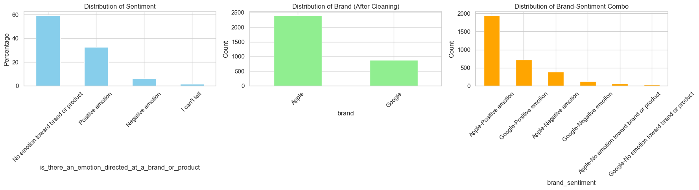
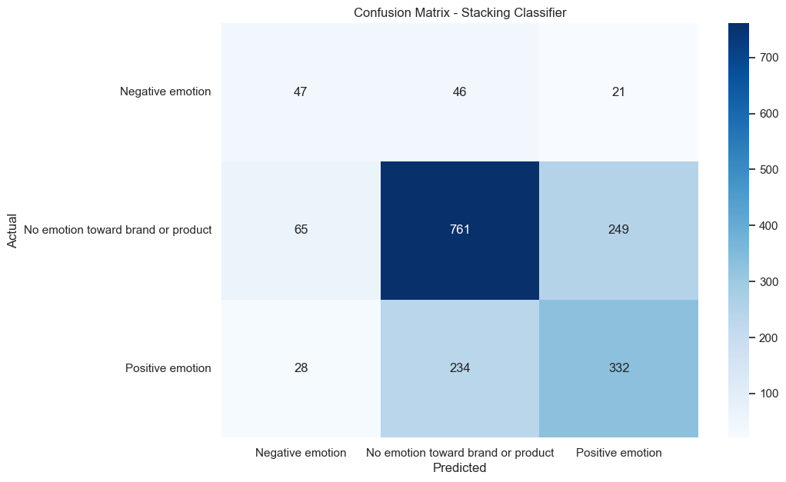

# Sentiment Analysis on Google and Apple Products
---
## Collaborators
1. Catherine Maina
2. Rita Nkirote
3. Gerald Mwangi
4. Joan Njuki
5. Leah Mukundi
6. Peter Chemonges
---
## Project Overview

This project focuses on analyzing sentiments expressed in tweets about **Google** and **Apple** products. The main goal is to build a machine learning model capable of classifying tweets as **positive** or **negative**, helping businesses understand customer perceptions and make informed decisions.

---
### Project Collaboration

To ensure smooth teamwork and effective execution, we used **Notion** as our project management tool. It allowed us to organize the project timeline, assign and track tasks, and coordinate team contributions efficiently.  
View our project planner here: [Notion Project Planner](https://www.notion.so/Group-Project-Planner-25dab49cbc0480d689b1f02636462aad?source=copy_link).

---
## Objectives
- Collect and clean raw Twitter data related to Google and Apple products.  
- Explore and analyze sentiment distributions.  
- Build and evaluate multiple machine learning models for sentiment classification.  
- Identify the best-performing model and save it for deployment (`sentiment_model.pkl`).  
- Deploy the model to a cloud-based service (Flask/FastAPI) for real-time sentiment analysis.  
---
## Business Understanding
Businesses need to understand public opinion about their products quickly and accurately. Manually analyzing social media sentiment is time-consuming and inefficient. Automating sentiment analysis provides insights that help companies:  
- Respond faster to customer concerns.  
- Detect risks to brand reputation early.  
- Align marketing strategies with customer perception.  

The dataset used in this project was gathered from **Twitter via CrowdFlower**. It contains three key columns:  
1. **Text** – The tweet content.  
2. **Product** – Whether the tweet refers to Google or Apple.  
3. **Sentiment** – The sentiment label (positive or negative).  

The main goal is to predict the sentiment of a tweet directly from raw text.

---
## Data Understanding
Before modeling, we explored the dataset to better understand its structure and challenges:  

- **Columns:** Tweet text, product mentioned (Google/Apple), sentiment label (positive/negative).  
- **Label Distribution:** Both positive and negative classes were fairly balanced, ensuring reliable model training.  
- **Text Characteristics:**  
  - Informal and noisy (emojis, hashtags, mentions, URLs).  
  - Varying lengths, from very short comments to longer sentences.  
  - Slang, repeated characters, and abbreviations.  
- **Data Quality Issues:** Some missing tweets were dropped during preprocessing.  

To address these, we used **NLTK** and **regex** for text cleaning and **scikit-learn** for building models.

---

## Exploratory Data Analysis (EDA)

To better understand the dataset and inform preprocessing decisions, several aspects of the data were explored. A significant portion of the tweets focused on **Apple**, with fewer referencing **Google**, indicating an imbalance in company mentions. The tweet text was found to be informal and noisy, often including elements like emojis, hashtags, mentions, and URLs. This highlighted the need for thorough text cleaning. Additionally, some records contained missing values, which were removed to ensure data quality. We also examined the distribution of tweet lengths to get a sense of how concise or detailed the messages were, which helped guide tokenization and padding strategies during preprocessing.



---

## Model Selection
We experimented with several machine learning models for sentiment classification:  

- **Logistic Regression**  
- **Naive Bayes**   
- **XGBoost**   
- **Stacking Classifiers**   

The **Stacking Classifier (pipeline_multi2)** was selected as the final model.  
It was saved as **`sentiment_model.pkl`** for deployment.

---
## Results
- Text preprocessing (cleaning, tokenization, and vectorization) significantly improved accuracy.  
- Ensemble models (XGBoost, Stacking) outperformed simpler baselines (Logistic Regression, Naive Bayes).  
- The final model can reliably classify tweets into positive or negative sentiment, providing actionable insights. 



---
## Conclusions
1. Text preprocessing played a critical role in improving model accuracy.  
2. Ensemble models consistently delivered better results than baseline approaches.  
3. Automating sentiment analysis allows companies to detect risks early and respond faster.  
4. Insights from sentiment data can directly influence **marketing strategies, product improvements, and customer engagement**.  

## Recommendations
1. **Deployment:** Integrate the model into a cloud-based API (Flask/FastAPI) for real-time sentiment scoring.  
2. **Monitoring:** Build dashboards (Streamlit/Power BI/Tableau) to track sentiment trends over time.  
3. **Continuous Learning:** Retrain with new tweets regularly to adapt to evolving slang and hashtags.  
4. **Business Application:**  
   - Improve customer support responsiveness.  
   - Tailor marketing campaigns to positive/negative sentiment trends.  
   - Detect and address emerging product issues early.  

---

##  Sentiment Analysis API

This is a Flask-based sentiment analysis API that predicts emotions from text using a trained machine learning model.

###  Live Demo

👉 [Try the API on Heroku](https://tweetmoodz-a6e4ceda30b2.herokuapp.com/)

You can send a `POST` request to the `/predict` endpoint with JSON like:

```json
{
  "text": "I love this app!"
}
{
  "input_text": "I love this app!",
  "predicted_sentiment": "Positive emotion"
}

